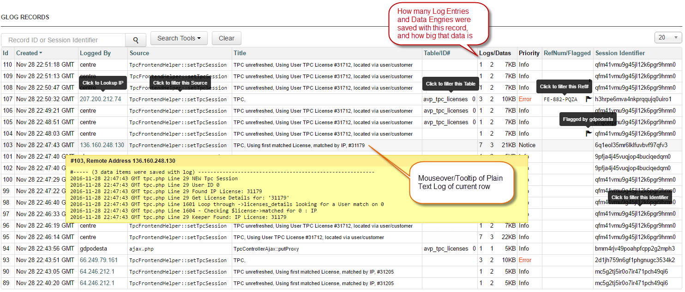
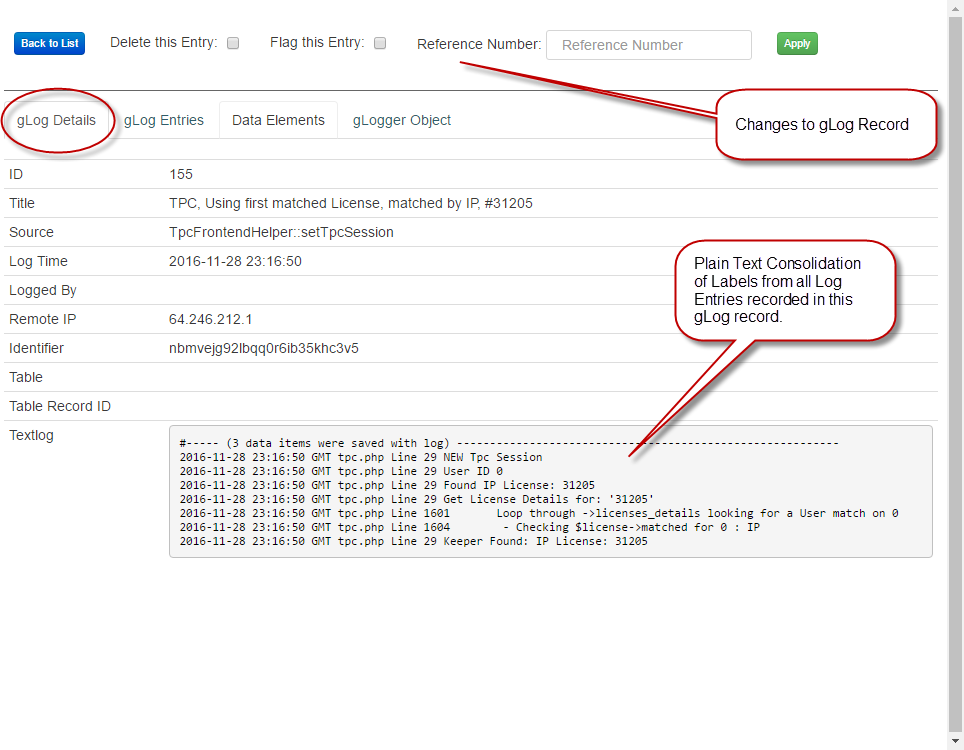
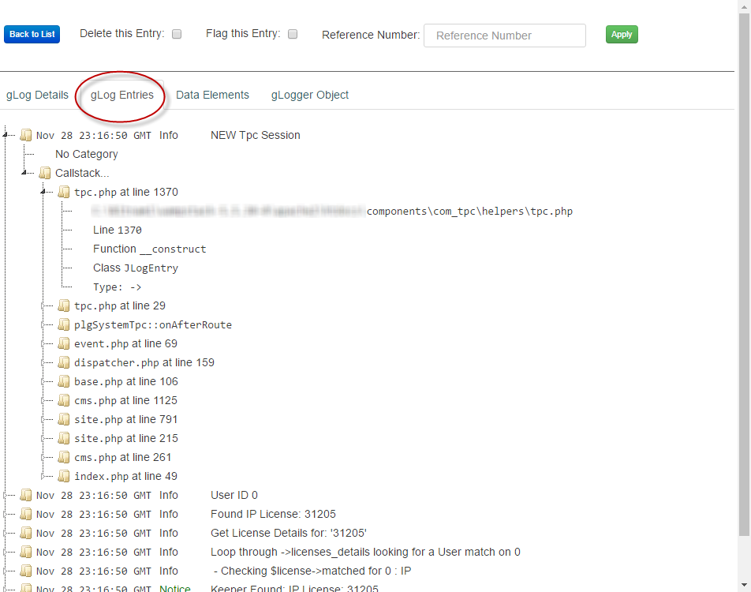
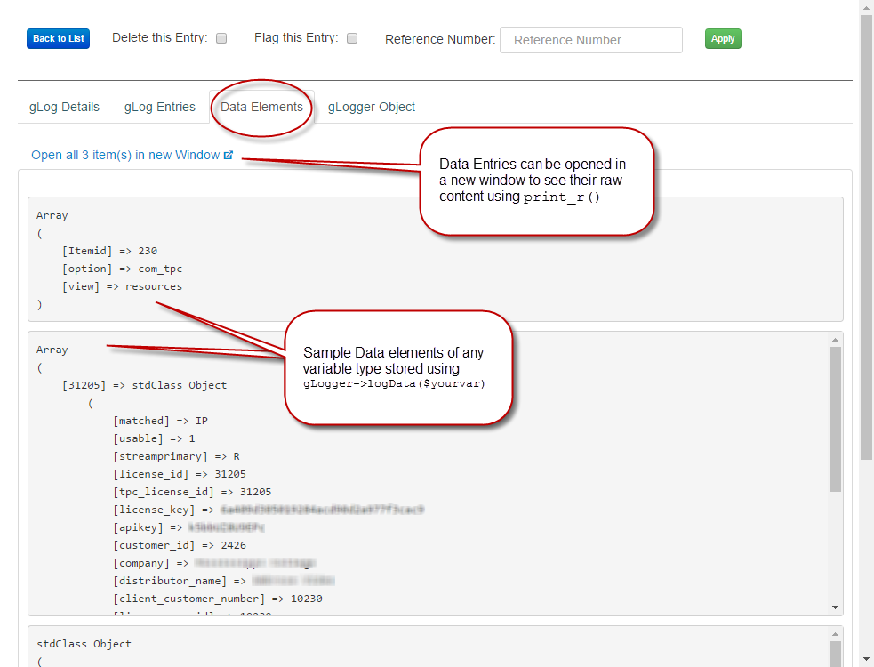
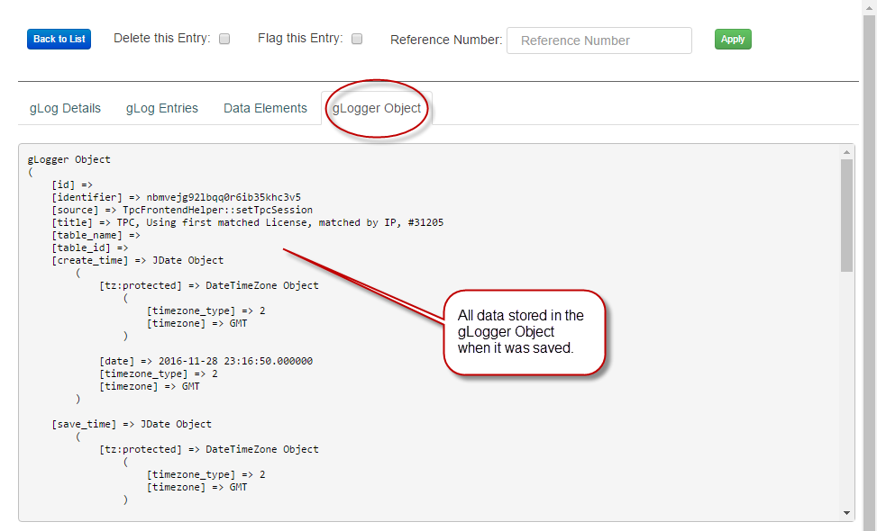
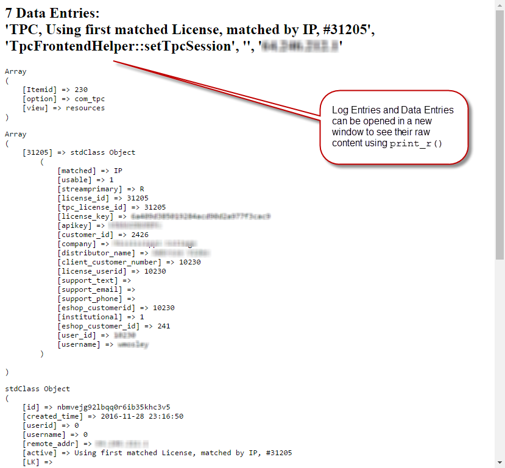
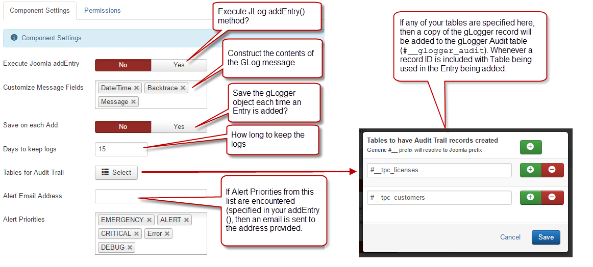
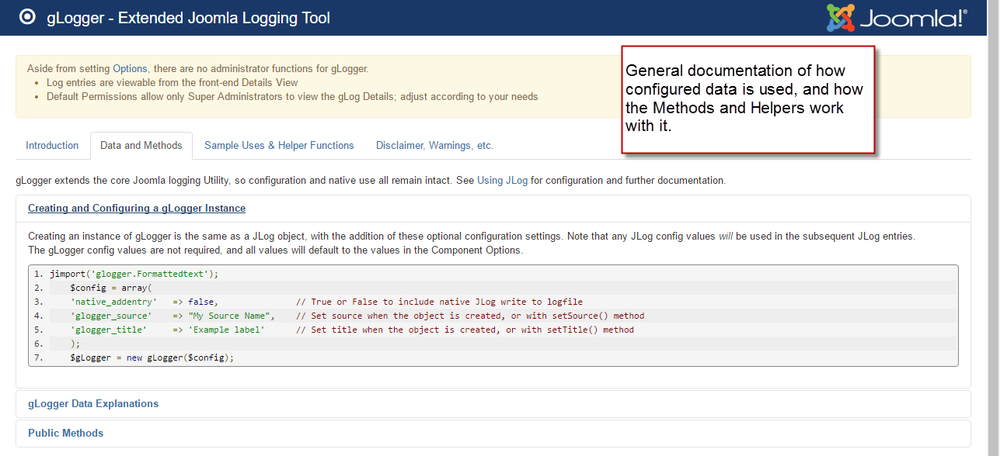
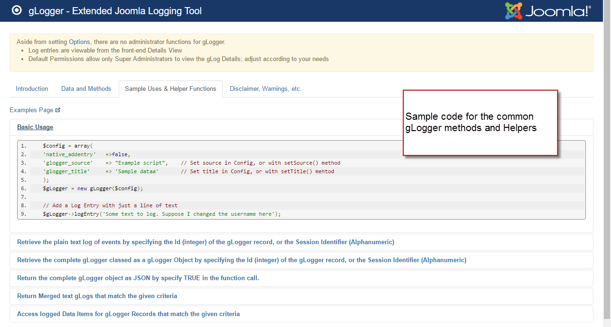
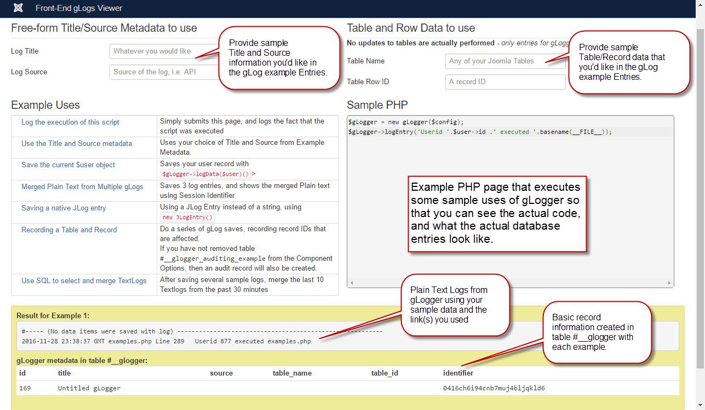

# glogger: Joomla Global Logging

gLogger started as a simple class to extend the standard JLog class so that the logging information was saved in a table rather than in text files scattered around the \logs folder.  Initially, it just stored standard data so that I could view in a single place.  I quickly realized that all sorts of other pertinant data was available, and that may other functions could be incorporated.

Here's my initial offering.  It started as a Class to extend JLog, and then a quick UI to see the data, then some methods, then some of this, and some of that to see if....  Long story short, it was never "designed", it's been a series of tweaks and experiments to see how usable I can make it.  If there is any serious interest in using it, I'll likely refactor some things and clean up the code - please don't judge me based on the guts of this thing, lol.

<strong>Main gLogger Listing View</strong> Allows sorting/filtering/selelection of all gLog records in the database.
  

<strong>gLog Details</strong> The basic information about the gLogger record, and the Plain Text consolition of it's entries
  

<strong>gLog Entries</strong> Each gLog Entry shown wtih jsTree, including the full backtrace of each call
  

<strong>Data Elements Listing View</strong>  If you add any data to the gLogger using <code>->addData()</code>, then it each is displayed here
  

<strong>gLogger Object</strong> The full gLogger object displayed using <code>print_r()</code>
  

<strong>External Window for viewing Large Objects</strong> If there are a lot of Log Entries, or large/complex data items, this window can be opened to view them in their entirety using <code>print_r()</code>
  

<strong>gLogger Configuration Options</strong> Standard Joomla Component Options
  

<strong>Component Documentation - Data and Methods</strong> Documentation of gLogger Data and Methods (<em>very much a work in progress</em>)
  

<strong>Component Documentation - Uses and Helper Function</strong> Documentation of gLogger Uses and Helper Function (<em>very much a work in progress</em>
  

<strong>Examples PHP page</strong> Working PHP script and links using the gLogger class that shows the code used and the resulting Logss and database entries  (<em>very much a work in progress</em>
  

